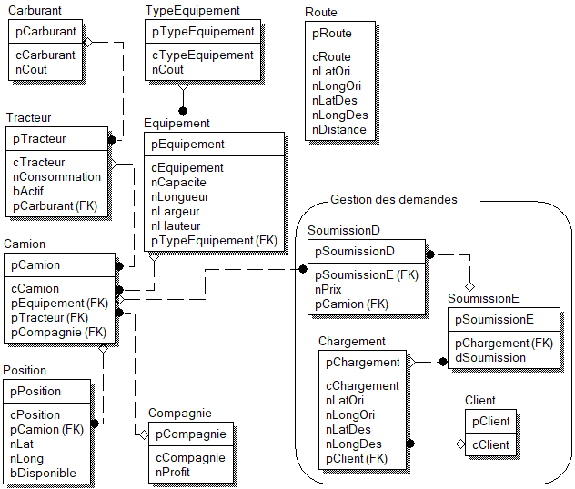

# Travail pratique 2 - Utilisation et développement de programmes dans un SGBDR

## Objectif

 L'objectif général de pratiquer des notions vues et similaires à celles que l'on retrouve en entreprise ainsi
 que réaliser la conception, la modélisation, la construction et l'exploitation de bases de données dans un SGBDR. 
 
 Spécifiquement :
 + Comprendre un modèle entité-association relationnel normalisé;
 + Concevoir un schéma sous forme de script SQL à partir d'un modèle EAR;
 + Concevoir et exécuter des requêtes afin de charger la BD;
 + Utiliser des outils externes pour accomplir des tâches sur les BD;
 + Concevoir et exécuter des requêtes afin de vérifier le contenu la BD;
 + Concevoir des programmes qui s'exécutent dans le SGBDR;

## Détails pour la réalisation

### TP2

- Tous les attributs clés devront être générés avec une gachette;
- Une demande de transport, **Chargement**, sera ajouté avec la procédure p_demande();
- Les soumissions sont calculées à l'aide de la procédure p_soumission();
- Les soumissions acceptées deviennent des commandes et devront être sauvegardées;
- La procédure p_commande() construit la commande pour une soumission;
- La fonction f_prix() calcule le prix pour chacune des lignes de détails de soumission;
- La table `route`, **est un cache**, qui contient les trajets, et leurs distances, souvent utilisés;
- Les détails de réalisation du TP1 doivent être tous présents.

### TP1
- Les donneurs de voyage sont appelés manufacturiers;
- Le transporteur peut avoir plusieurs camions;
- Un camion implique deux parties, le tracteur et la remorque;
- Un tracteur est actif (1) ou inactif (0); 
- Les camions appartiennent à une compagnie;
- Une compagnie fait toujours le même profit (un pourcentage : 1.18) sur tous les voyages;
- Un camion est disponible lorsqu'il n'est pas en voyage;
- Drybox et flatbed sont des types de remorques;
- Il y a un coût différent par type d'équipements;
- Les camions sont toujours situés à un endroit (latitude, longitude);
- Un trajet est constitué d'une origine vers une destination;
- Les propositions de tarification sont des estimations de prix à payer pour un trajet;
- La proposition de tarification est créée à une date;
- Les facteurs qui servent à calculer le prix à payer d'un voyage sont:
  + le prix du carburant;
  + la distance du trajet;
  + la consommation de carburant du tracteur;
  + le poids du chargement;
  + l'espace occupé dans la remorque;
  + le type de remorque;
  + la marge de profit du transporteur;
- Le prix du carburant est au litre;
- La consommation du tracteur est en litre pour 1 Km;

## Guide pour la création des noms

  - La notation hongroise est d'usage pour nommer vos attributs.

### Abréviations acceptées (à utiliser)
| Mot | Abréviation | Colonne |
| :----------- |:------------ | :------|
| Latitude     | Lat   | nLat  |
| Longitude    | Long  | nLong |
| Origine      | Ori   |       |
| Destination  | Des   |        |
| Latitude d'origine | LatOri | nLatOri |
| Longitude destination | LongDes | nLongDes |
| Entete de Soumission | SoumissionE | <-- Table |
| Détail de Soumission | SoumissionD | <-- Table |
| Entete de Commande | CommandeE | <-- Table |
| Détail de Commande | CommandeD | <-- Table |

## Les entités

## Prototypage des fonctions

Les signatures sont :
+ p_demande(pClient, nLatOri, nLongOri, nLatDes, nLongDes, nPoid, nValeur);
+ p_soumission(pChargement);
+ p_commande(pSoumissionE);
+ f_prix(pSoumissionD);

# Livrables

+ Les fichiers sont exécutés séquentiellement;

### 01_schema.sql
  Votre schéma doit être dans un fichier de type texte (souvent appelé *script*) 
  nommé `01_schema.sql` et devra contenir des commandes qui créera votre base de données alias
  schéma. Toutes les commandes utilisées sont celles du DDL.  Le fichier sera exécuté 2 fois.
  Assurez-vous qu'il n'y a pas d'erreur.

### 02_sequence.sql

 À ce point-ci dans votre apprentissage, vous savez exactement comment créer des séquences, et pourquoi elles sont
 nécessaires. Ce fichier contient le code. 

### 03_gachette.sql

 + Ce fichier est nécessaire pour créer toutes les gachettes. 

### 04_procedure.sql

 + Ce fichier contiendra la création des procédures et fonctions.

### Chargement avec SQL*Loader (sqlldr)

+ Certaines données peuvent être importées depuis un fichier CSV ou TSV via Oracle :copyright: SQL*Loader (sqlldr).
  
  Les fichiers suivants doivent exister :
  + 05a_route.txt (fourni) ou peut-être `route.txt`
  + 05a_route.ctl
  + 05a_route.log
  + 05a_route.sh
  
### 05b_charger.sql
  Vous devez ensuite créer le *script* nommé `04_charger.sql` qui remplira votre BD.
  Ce dernier doit contenir des commandes INSERT principalement. Le DML est d'usage pour
  compléter ce fichier.

### 06_tester.sql
  Vous devez dans un fichier nommé `06_tester.sql` écrire des requêtes qui vous aident 
  à réaliser un travail de qualité.  Il est toujours important de faire des tests. Puisque
  nous ne voulons pas perdre nos tests, je vous invite à les sauvegarder ici.
  Ce fichier n'est pas facultatif.  Mais son contenu est de votre création.  Auncune directive
  ne vous sera imposée pour sa réalisation.

### 07a_query.sql

### 07b_query.sql

### 07c_query.sql
 
### 08_algebre-tp1.pdf

### README.md

  Le fichier nommé `README.md` qui décrit le contenu et qui **respecte le format Markdown**.
  Il doit minimalement contenir les informations ci-bas :

~~~~
   # Travail pratique 1

   ## Description

   <description du projet en quelques phrases>
   <mentionner le contexte (cours, sigle, université, etc.)>

   ## Auteur

   <prénom et nom> (<code permanent>)

   ## Fonctionnement

   <expliquez brièvement comment faire fonctionner votre projet, en inscrivant
   au moins deux exemples d'utilisation (commande lancée et résultat affiché)>

   ## Contenu du projet

   <décrivez brièvement chacun des fichiers contenus dans le projet (une phrase
   par fichier)>

   ## Références

   - <citez vos sources ici>

   ## Statut

   + <indiquez si le projet est complété ou s'il y a des bogues>
   
   ## Auto-évaluation de votre travail
   
   + <j'évalue mon livrable à x points>
   
   ## Difficultés rencontrées
   
   + <1. >
   + <2. >
~~~~

# Remise

  La totalité de votre travail doit être remis au plus tard le **13 décembre 2019** à **11h59**. 
  À partir de cette date/heure, une pénalité de **12 points par jour** de retard sera appliquée.

  La remise se fait **obligatoirement** par l'intermédiaire de l'une des plateformes de gestion de version suivantes :
  + `GitHub https://github.com/`;
  + ~~`GitLab https://gitlab.com/`;~~
  + ~~`GitLab UQAM`.~~
  
  **Aucune remise par courriel ne sera acceptée** (le travail sera considéré comme non remis).

Le nom de votre projet, qui sera `privé` pour des raisons liées au plagiat, doit être `inf3080-a2019-tp2`
(en minuscules). Vous devez donner un accès en mode collaboration à l'utilisateur 
  + `guyfrancoeur` pour les gens de INF3080-030 A2019;
  
  Il sera ainsi possible pour le/les enseignants de commenter et noter votre travail de façon discrète.

  La branche `master` sera celle `clonée` et sera celle qui sera évaluée.

  En plus de la section `Livrable`, votre projet devrait idéalement contenir les fichiers suivants :
  - Un fichier `cp.txt` contenant votre code permanent en majuscule et complet (requis pour la publication des résultats);
  - Un fichier ``.gitignore``. Ça aide beaucoup;
  - Aucune structure de répertoire nécessaire.

# Correction et évaluation

Les travaux seront corrigés sur le serveur __*Zeta2*__. Vous devez donc vous assurer que votre livrable
fonctionne **sans modification** sur celui-ci.
  
Votre travail sera évalué de façon automatisée.  Ce qui implique que vos dépôts seront
clonés et un pull sera effectué de façon automatique. Un `pull` par jour.
Il n'y aura pas d'humain pour faire fonctionner les programmes (scripts). 
Votre travail sera soumis à plusieurs cas et les résultats seront évalués par un script 
`bash` et des routines SQL ou des programmes PL/SQL.
Assurez-vous de bien lire toutes les directives et les requis.

La réflexion est un élément essentiel qu'il faut pratiquer. Vous devez donc réfléchir et réaliser
un travail qui soit à la hauteur de ce que vous désirez.  Soyez beau, soyez bon, soyez fier.

> > Les fichiers seront soumis au détecteur de plagiat. Faites attention à la provenance de vos idées.

# Barème de correction (à titre indicatif draft à refaire)

| Critère | Sous-critère | Points |
| ------- |:------------ | ------:|
| Algèbre            | Algèbre relationnel                              | 2.0 |
| Schéma             | Script de création du schéma                     | 5.0 |
| Chargement sql     | Script de chargement des tables                  | 2.0 |
| Chargement csv/tsv | Chargement de données automatisé                 | 3.0 |
| Fonctionnalité     | Fonctionnalité, respect des exigences            | 12.0 |
| Git clone          | récupération (droit lecture, écriture)           | 1.0 |
| Markdown           | README.md                                        | 1.0 |
| **Total**          |                                                  | 26.0 / 25.0 |

La note maximale possible dans résultat est 25 points.

----
##### Auteur :copyright: 2019 Guy Francoeur
